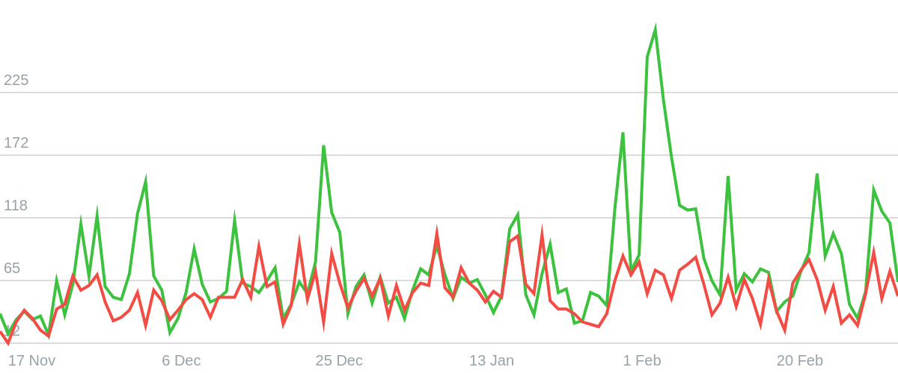
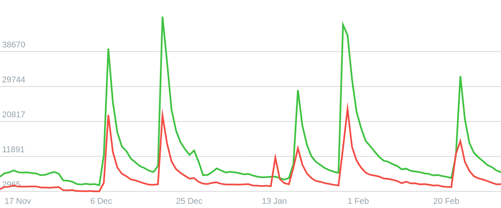
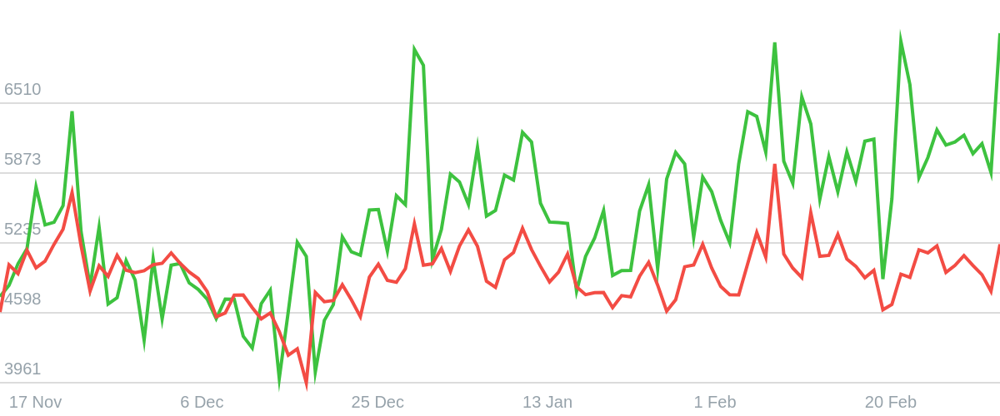
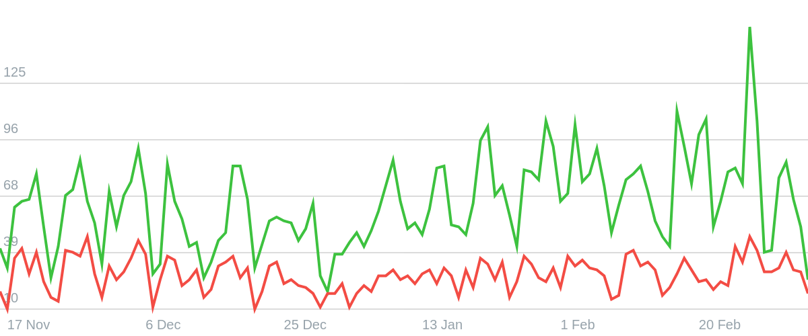
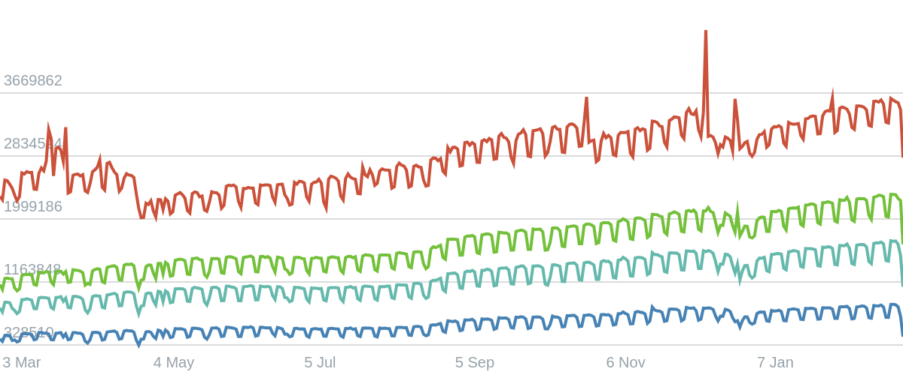

# simple-charts-js

> simple-charts-js - a simple lightweight library for drawing charts.

[](https://www.npmjs.com/package/simple-charts-js)
[](https://www.jsdelivr.com/package/npm/simple-charts-js)

[View Demo](https://kuscoder.github.io/simple-charts-js/) •
[Bug report](https://github.com/kuscoder/simple-charts-js/issues)

## 📊 Examples
<details open>
   <summary>Example 1</summary>
   
</details>

<details>
   <summary>Example 2</summary>
   
</details>

<details>
   <summary>Example 3</summary>
   
</details>

<details>
   <summary>Example 4</summary>
   
</details>

<details>
   <summary>Example 5</summary>
   
</details>

## ✨ Features
- Full TypeScript support
- Support all browsers
- Easy to use
- Lightweight
- Flexible

## 🎯 Install
### npm
For module bundlers such as `Webpack` or `Browserify`.

```shell
npm i simple-charts-js
```

### Include with &lt;script&gt;
Download and install with `script`.

```html
<script src="./simple-charts-js/dist/index.js" defer></script>
```

### CDN
Recommended for learning purposes, you can use the latest version:

```html
<script src="https://cdn.jsdelivr.net/npm/simple-charts-js@latest/dist/index.js" defer></script>
```

Recommended for production for avoiding unexpected breakage from newer versions:

```html
<script src="https://cdn.jsdelivr.net/npm/simple-charts-js@1.0.1/dist/index.js" defer></script>
```

## 🚀 Usage
### ES6
simple-charts-js as an ES6 module.

```js
import { Chart } from 'simple-charts-js'
const chart = new Chart(container, options)
```

### Node
simple-charts-js as a Node.js module

```js
const { Chart } = require('simple-charts-js')
const chart = new Chart(container, options)
```

### Browser
Exports a global variable called `SimpleChartsJS`. Use it like this

```html
<script>
  const chart = new SimpleChartsJS.Chart(container, options)
</script>
```

### AMD
simple-charts-js as an AMD module. Use with Require.js, System.js, and so on.

```js
requirejs(['simple-charts-js'], function(SimpleChartsJS) {
  const chart = new SimpleChartsJS.Chart(container, options)
})
```

## ⚙️ Configuration
### Chart container
Initializing the chart requires a link to the html element where the chart will be inserted. You may not pass any additional options, but in that case the chart will be empty.

```javascript
const container = document.getElementById('simple-chart-container')
const chart = new Chart(container)
```

### General options
General chart options such as `width` and `height` - chart dimensions depend on them. We also have `padding` - this is the top and bottom indentation for chart vertices lines. `rowsCount` is responsible for the number of horizontal guide lines with numeric marks of chart values

> **NOTE:** Keep in mind that the value you specify for the `padding` property may be multiplied by 2, this is due to the internal features of the chart, if you want to specify 20 px - feel free to specify 40.

```javascript
const chart = new Chart(container, {
   width: 600, // 600 px
   height: 250, // 250 px
   padding: 40, // Real 20 px
   rowsCount: 5 // 5 rows guide
})
```

### Data options
This category of options is considered the most important, since it is responsible for drawing the timeline and vertices lines of the chart.

#### Timeline
The timeline is what is displayed at the bottom of the chart and makes it easier to navigate the chart using the guide lines. In this version of the package, only one `type` of timeline is available - `date`, the values of which must be a timestamp for the date in milliseconds.

> **NOTE:** To get timestamps from a date, you can use `Date.now()` to get the current time, `someDate.getTime()` - to get the time of the date instance.

```javascript
const chart = new Chart(container, {
   data: {
      timeline: {
         type: 'date',
         values: [1542412800000, 1542499200000, 1542585600000, 1542672000000]
      }
   }
})
```

#### Lines
Lines are an array of objects. Each object is one line, of which there may be several. The line has some settings: `key` is a technical property that is currently not used anywhere. `name` - the name of the specific line that is displayed in the tooltip. `color` - the color that the line is drawn with also affects the color of the guide circles on the vertical guide line and the color displayed in the tooltip. And finally, the most important thing is the `vertices`, this is an array of line vertices with which the chart is drawn.

> **NOTE:** To display correctly, the index of a particular vertices item must match the index of the timeline element. Matching indexes ensures that the vertices item is linked to the timeline item.

```javascript
const chart = new Chart(container, {
   data: {
      lines: [
         {
            key: 'y0',
            name: '#0',
            color: '#3dc23f',
            vertices: [37, 20, 32, 39] // The indexes are in the same order as in the timeline
         }
      ]
   }
})
```

### Internationalization options (I18N support)
Allows you to configure multi-language for the chart.

```javascript
const chart = new Chart(container, {
   i18n: {
      months: ['Jan', 'Feb', 'Mar', 'Apr', 'May', 'Jun', 'Jul', 'Aug', 'Sep', 'Oct', 'Nov', 'Dec']
   }
})
```

### Interactivity options
This category contains properties that are responsible for the interactivity of the chart.

#### Tooltip position
Defines the position of the tooltip in relation to the cursor. Valid values: `top`, `left`, `bottom`, `right`, `top-left`, `top-right`, `bottom-left` and `bottom-right`

```javascript
const chart = new Chart(container, {
   interactivity: {
      tooltipPosition: 'top-right'
   }
})
```

#### Horisontal guide
Determines whether the horizontal guide line should be drawn or not. For the most part, it is purely decorative, so it can be disabled.

```javascript
const chart = new Chart(container, {
   interactivity: {
      horisontalGuide: true
   }
})
```

#### Radius of guide points
Circle radius of the selected vertex on the vertical guide line.

> **NOTE:** Keep in mind that the value you specify for the `guideDotsRadius` property may be multiplied by 2, this is due to the internal features of the chart, if you want to specify 4 px - feel free to specify 8.

```javascript
const chart = new Chart(container, {
   interactivity: {
      guideDotsRadius: 8 // Real 4 px
   }
})
```

#### FPS limit
Allows you to set a limit of chart redraws per second, which can affect performance. This functionality is implemented by such technology as `throttle` - limiting the number of function calls within a certain time interval

```javascript
const chart = new Chart(container, {
   interactivity: {
      fpsLimit: 60
   }
})
```

#### Disable all interactive
Disable all interactive chart functions. The end user will not be able to interact with the chart in any way other than just looking at it.

```javascript
const chart = new Chart(container, {
   interactivity: {
      disable: false
   }
})
```

### Style options
Adjusts the display style of the chart.

#### Text font and color
The font and color of the texts and values for the canvas.

> **NOTE:** Variables are exported to the main css class of the chart wrapper as `--text-font` and `--text-color` values

```javascript
const chart = new Chart(container, {
   style: {
      textFont: 'normal 20px Helvetica, sans-serif',
      textColor: '#96a2aa',
   }
})
```

#### Secondary and background colors
Secondary color adjusts the color of borders and guide lines. The background color in turn paints the canvas with its own color before each rendering. For this reason, we do not recommend using transparent values.

> **NOTE:** Variables are exported to the main css class of the chart wrapper as `--secondary-color` and `--background-color` values

```javascript
const chart = new Chart(container, {
   style: {
      secondaryColor: '#bbbbbb',
      backgroundColor: '#ffffff',
      classNames: {
         wrapper: 'simple-chart',
         canvas: 'simple-chart__canvas',
         tooltip: 'simple-chart__tooltip'
      }
   }
})
```

#### Custom class names
Allows you to configure custom class names for chart elements that will help in custom styling of the component. Note that, if you use our pre-prepared styles along with this option, they will not work. You will have to reassign all the styles from scratch. You can simply copy them from `'./simple-charts-js/dist/index.css'` into your css file.

> ~~import './node_modules/simple-charts-js/dist/index.css'~~<br/>
> Does'nt works with custom class names

```javascript
const chart = new Chart(container, {
   style: {
      classNames: {
         wrapper: 'simple-chart',
         canvas: 'simple-chart__canvas',
         tooltip: 'simple-chart__tooltip'
      }
   }
})
```

### Technical options
Technical options, these are the options that are responsible for the deep technical part of the chart, most of the time they are not used by the average user.

#### Debug mode
The debug mode is intended for developers. Enabling this mode makes it easier to monitor the chart operation during development.

```javascript
const chart = new Chart(container, {
   technical: {
      debug: true
   }
})
```

#### Component insertion method
Allows you to control which part of the container that was passed in during initialization the entire chart component will be inserted into. Valid values `append` or `prepend` or `callback function`

```javascript
// The chart will be inserted at the end of the container
const chart = new Chart(container, {
   technical: {
      insertMethod: 'append'
   }
})

// The chart will be inserted at the beginning of the container
const chart = new Chart(container, {
   technical: {
      insertMethod: 'prepend'
   }
})

// You decide where the chart will be inserted
const chart = new Chart(container, {
   technical: {
      insertMethod: (containerElement, chartWrapperElement) => {
         // containerElement - is your container
         // chartWrapperElement - is a main wrapper of the chart (by default with class .simple-chart)
         containerElement.appendChild(chartWrapperElement)
      }
   }
})
```

#### Life cycle
The chart instance has built-in methods such as `initialize` and `destroy`. By default, the initialization method is called when the class instance is created, but if you want to control this manually, you can set the `immediateInit` option to `false`.

```javascript
const chart = new Chart(container, {
   technical: {
      // Disables automatic chart initialization
      immediateInit: false
   }
})

// And do it yourself
if (sometingAction) {
   chart.initialize()
}

// And also destroying
if (sometingAction) {
   chart.destoy()
}

// Do you want to reinitialize the chart after destroying it? No problem
if (sometingAction) {
   chart.initialize()
}
```

### Example with all available options
Note that all these options except the `data` option are set by default when creating a chart instance.

```javascript
const chart = new Chart(container, {
   width: 600,
   height: 250,
   padding: 40,
   rowsCount: 5,
   data: {
      timeline: {
         type: 'date',
         values: [1542412800000, 1542499200000, 1542585600000, 1542672000000]
      },
      lines: [
         {
            key: 'y0',
            name: '#0',
            color: '#3dc23f',
            vertices: [37, 20, 32, 39]
         }
      ]
   },
   i18n: {
      months: ['Jan', 'Feb', 'Mar', 'Apr', 'May', 'Jun', 'Jul', 'Aug', 'Sep', 'Oct', 'Nov', 'Dec']
   },
   interactivity: {
      tooltipPosition: 'top-right',
      horisontalGuide: true,
      guideDotsRadius: 8,
      fpsLimit: 60,
      disable: false
   },
   style: {
      textFont: 'normal 20px Helvetica,sans-serif',
      textColor: '#96a2aa',
      secondaryColor: '#bbbbbb',
      backgroundColor: '#ffffff',
      classNames: {
         wrapper: 'simple-chart',
         canvas: 'simple-chart__canvas',
         tooltip: 'simple-chart__tooltip'
      }
   },
   technical: {
      debug: true,
      insertMethod: 'append',
      immediateInit: true
   }
})
```

## 🎨 Styles
To display the chart correctly, you can't do without styling it with css. Let's get started.

### Import prepared styles
Of course, this is optional, because you can style the chart manually using the classes it provides. However, even if you plan to modify the chart styles, we advise you to plug in the styles we've prepared and modify them in your css file. This way, the chart styling will definitely not get broken.

#### JavaScript
```javascript
import './node_modules/simple-charts-js/dist/index.css';
```

#### HTML
```html
<link rel="stylesheet" href="./node_modules/simple-charts-js/dist/index.css">
```

#### CSS
```css
@import url('./node_modules/simple-charts-js/dist/index.css');
```

### Custom styles
By default, the chart has a fixed list of classes that it provides for styling using css. You can change the names of each of them when initializing the chart.

#### Class names
```css
.simple-chart-js {} /* Main wrapper */
.simple-chart-js__canvas {} /* Canvas */
.simple-chart-js__tooltip {} /* Tooltip */
```

#### Recommendations
The main wrapper class contains css variables of some styles that you can use anywhere inside the main wrapper. You can change them when initializing the chart.

```css
/*
   var(--text-font)
   var(--text-color)
   var(--secondary-color)
   var(--background-color)
*/

.simple-chart-js {
   font: var(--text-font);
   color: var(--text-color);
}

.simple-chart-js__canvas {
   border: 1px solid var(--secondary-color);
}

.simple-chart-js__tooltip {
   background-color: var(--background-color);
}
```

&copy; Nikita Kus
