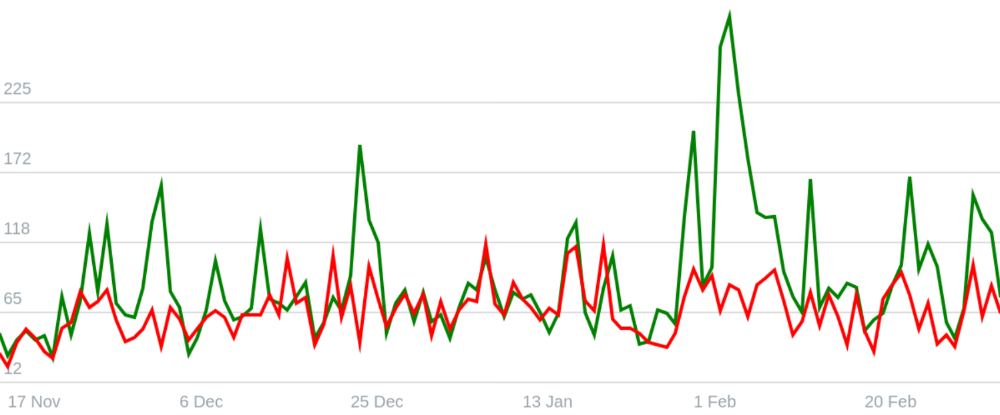

# simple-charts-js

> simple-charts-js - a simple lightweight library for drawing charts.

[](https://www.npmjs.com/package/simple-charts-js)
[](https://www.jsdelivr.com/package/npm/simple-charts-js)

## Example


## Features
- Full TypeScript support
- Support all browsers
- Easy to use
- Lightweight

## Table of Contents
- [Quick start](#quick-start)
  - [Install](#install)
  - [Initialization](#initialization)

## Quick start
### Install
We support all platforms.

#### npm
For module bundlers such as Webpack or Browserify.

```shell
npm i simple-charts-js
```

#### Include with &lt;script&gt;
Download and install with `script`.

```html
<script src="simple-charts-js.js"></script>
```

##### CDN
Recommended for learning purposes, you can use the latest version:

```html
<script src="https://cdn.jsdelivr.net/npm/simple-charts-js/dist/index.js"></script>
```

Recommended for production for avoiding unexpected breakage from newer versions:

```html
<script src="https://cdn.jsdelivr.net/npm/simple-charts-js@0.0.1/dist/index.js"></script>
```

### Initialization
#### ES6
simple-charts-js as an ES6 module.

```js
import { Chart } from 'simple-charts-js'
const chart = new Chart(container, options)
```

#### Node
simple-charts-js as a Node.js module

```js
const { Chart } = require('simple-charts-js');
const chart = new Chart(container, options)
```

#### Browser
Exports a global variable called `SimpleChartsJS`. Use it like this

```html
<script>
  const chart = new SimpleChartsJS.Chart(container, options)
</script>
```

#### AMD
simple-charts-js as an AMD module. Use with Require.js, System.js, and so on.

```js
requirejs(['simple-charts-js'], function(SimpleChartsJS) {
  const chart = new SimpleChartsJS.Chart(container, options)
});
```

&copy; Nikita Kus
